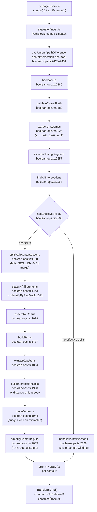

# PathBlock Boolean Operations — Pipeline Audit

**Date:** 2026-04-30
**Scope:** `src/evaluator/boolean-ops.ts` (2,452 lines)
**Trigger:** "Diagonal close" notch in adjacent-T glyph union (post12 `CUTTING` cutout demo, April 2026). Earlier post-process band-aids cleared near-zero coordinate residue and small triangular spurs but did not address the structural artifact: contours assembled with the wrong continuation when intersection points cluster.
**Goal:** Catalog every failure mode in the boolean-op pipeline so the next regression is matched against this map rather than rediscovered, then act on the prioritized fixes.

---

## 1. Pipeline map

The starred stage (`buildIntersectionLinks`) is the **prime suspect** for the diagonal-close notch — see §3.

---

## 2. Per-stage failure-mode catalog

### 2.1 `findAllIntersections` (boolean-ops.ts:1154) → `hasEffectiveSplits` gate (2308)

| Field | Value |
|---|---|
| **Failure mode** | Two paths that touch but don't cross at vertex points fall through to `handleNoIntersections` and get classified by single-sample winding number — wrong answer for tangent-touch cases. |
| **Mechanism** | `hasEffectiveSplits` filters out vertex-vertex intersections (both `tA` and `tB` near 0 or 1). When all detected intersections are vertex-vertex, the gate routes to `handleNoIntersections` which samples one point per path and runs winding. A single sample of a glyph-interior path cannot tell you about per-subpath topology. |
| **Trigger** | Two glyphs that touch only at corner endpoints (e.g., letterforms with axis-aligned cap edges meeting flush at a baseline). |
| **Current mitigation** | None — the routing to `handleNoIntersections` is the design. |
| **Sufficient?** | No. Vertex-vertex contact does carry topological information that the single-sample fallback throws away. P2 fix: extend `hasEffectiveSplits` to recognize vertex-vertex contacts and route them through the full assembly path with a synthetic split, instead of the reduced fallback. |

### 2.2 `splitPathAtIntersections` `MIN_SEG_LEN = 0.5` (1232)

| Field | Value |
|---|---|
| **Failure mode** | Two real, distinct intersections within 0.5 path units of each other are merged into one split point. The contour loses a topology-bearing vertex. |
| **Mechanism** | Lines 1226–1248 sort split t-values and merge any pair whose Euclidean distance on the source segment is below `MIN_SEG_LEN`. Original purpose (commit `a4f7030`): suppress spurious near-coincident detections from fuzzy intersection finders. |
| **Trigger** | Two adjacent glyphs at heavy overlap (`tracking ≤ 0.4`) where caps meet near a vertical stem — produces 2+ real intersections clustered within 0.3 path units. |
| **Current mitigation** | None. The threshold is a single hard-coded constant in path units. |
| **Sufficient?** | No. P2 fix: scale `MIN_SEG_LEN` by local segment scale (e.g., `min(0.5, segLen * 0.001)`) so small features at small scales still get distinct splits. Document that the original intent was de-fuzzing identical detections, not feature-merging. |

### 2.3 `classifyByRingWalk` seed at `t = 0.3, 0.7` (1548)

| Field | Value |
|---|---|
| **Failure mode** | Both samples fall on the boundary of `otherPath`; winding number is unreliable; seed is wrong; the entire ring walk's classification is wrong. |
| **Mechanism** | Lines 1545–1564 try one segment at `t=0.3` and `t=0.7` looking for a "reliable seed" where both samples agree. If the segment is itself a shared boundary edge (common for axis-aligned-glyph unions), both samples sit on the boundary, the winding calls return 0 or 1 nondeterministically, and the seed fallback to midpoint also lies on the boundary. |
| **Trigger** | Two glyphs sharing axis-aligned boundary segments (vertical stems aligned, horizontal caps aligned). Common in monospace fonts and tightly-tracked sans-serifs. |
| **Current mitigation** | Midpoint fallback (also on boundary). |
| **Sufficient?** | No. P1 fix (Phase 3 of this work): replace the fixed `[0.3, 0.7]` pair with an escalating sequence `[0.5, 0.3, 0.7, 0.1, 0.9, 0.2, 0.8, 0.4, 0.6]` and accept the first pair where both samples agree. Drastically reduces the "all-on-boundary" failure rate without changing classification semantics. |

### 2.4 `isCrossingAtBoundary` cross-product threshold = 0.05 (1514)

| Field | Value |
|---|---|
| **Failure mode** | Near-tangent crossings (where the two paths' tangent vectors are within ~3° of parallel) are classified as tangent-touch when they are in fact transverse, or vice-versa. The classification feeds into the keep/gap decision in `buildRings`. |
| **Mechanism** | Computes the 2D cross product of normalized tangents at the intersection. Returns `Math.abs(cross) > 0.05`. The 0.05 threshold corresponds to ~2.86° angular tolerance, hard-coded with no scale awareness. |
| **Trigger** | Two thin-stroke glyphs (e.g., Raleway 200) at heavy overlap, where caps glance off each other at small angles. |
| **Current mitigation** | The §2.4 winding-number fallback (samples at the boundary of `splitBefore` and `splitAfter`, decides by inside/outside parity) was added to handle near-tangent shared-edge cases. With §2.13 in place, line-line shared edges are now classified as `'on'` upstream — the wn-fallback is *redundant* for line-line shared cases, but it remains the only line of defense for non-shared near-tangent cases (curve-curve glances, intersections within float-noise tolerance) and is therefore retained. Phase A also added a vertex-snap in `detectSharedEdge_LineLine` (within 0.5 path units of a segment endpoint, the shared range snaps to the vertex). This eliminates the *one* asymmetric tiny-split case that originated from shared-edge geometry — no test regressions, but the Libre Bask EN wedge persists, indicating other intersection sources (between non-shared adjacent segments) are also producing the asymmetric run count. |
| **Sufficient?** | No. P2 fix: scale threshold by local curvature (or, simpler, treat the threshold as a cone angle and pick a value derived from typical font metric ratios). Out of scope for this round per direction — flagged for follow-up. The Libre Bask Bold UPPER `EN` tracking 0.5 residual wedge (see §2.13 Residual row) is a §2.4-class problem: E's right serif and N's left stem are *different* cubic curves intersecting at a near-tangent angle — no shared-edge work would classify them coincident, and the wn-fallback's perpendicular sample at split boundaries cannot disambiguate them at the required precision. |
| **Iter-3d-en (resolved)** | The wedge artifact at Libre Bask UPPER EN tracking 0.5 was driven by **two compounding issues**, neither of which was a §2.4 classifier error as initially hypothesized. **(1) Shared-edge endpoint snap was actively harmful.** The earlier `detectSharedEdge_LineLine` snap collapsed near-vertex shared-range endpoints to {0, 1} when the off-shared remainder was < 0.5 path units. For Libre Bask UPPER EN the shared range was `A.seg26[0.006..0.444]` ↔ `B.seg9[0..1]`: A.seg26 starts at (57.04, 0) but B.seg9 starts at (56.72, 0), giving A a real 0.32 px overhang from (57.04, 0) to (56.72, 0). Snapping `aStart=0.006 → 0` extended A's "shared" region to include the overhang, dropping it from A's run as `'on'`. The geometry is genuinely asymmetric — the overhang is real A outline that must remain in A's runs — so the snap was treating an apparent symptom of legitimate asymmetric geometry. The snap is **removed**; the helper now returns the projected ranges as-is. **(2) `traceContours` started chains from the wrong end of an open chain.** When Hungarian forms an open chain `run[2] → run[6] → run[1]` (the unmatched-tail case from genuine asymmetric topology), the prior contour tracer iterated `allRuns` in index order — picked `run[1]` first, traced it as a STANDALONE single-run contour (no outbound link), then later picked `run[2]` and traced `run[2] → run[6]` only (run[1] already visited). Result: an extra wedge-shaped subpath plus a truncated outer perimeter. **Fix**: build an inbound-link set before iterating, and visit chain-start runs (those with no inbound link) BEFORE runs reachable via links. With chain-starts visited first, the open-chain tail is attached to its proper predecessor and an implicit `z`-close to the chain-start's entry forms a clean contour. Asymmetric run counts are now handled correctly by topology, not by snapping intersections. The cross-path vertex-vertex drop (commit `5898b27`) remains in place — it independently handles the unrelated `(56.72, 0)` vertex-vertex case. All 36 cells of `failure-matrix-iter-1-en.pathogen` render clean. |

### 2.5 `buildIntersectionLinks` distance-only greedy ★ (1900)

| Field | Value |
|---|---|
| **Failure mode** | When N exit points and N entry points cluster at one geometric intersection, the topologically correct pairing is not necessarily the one with the smallest pairwise distances. Greedy distance-sorted assignment picks a globally suboptimal pairing whenever distance ordering disagrees with tangent ordering. |
| **Mechanism** | Lines 1903–1936 build all `(exitRun, entryRun)` candidate pairs across both paths' runs, sort by Euclidean distance between exit and entry points, then greedily assign shortest-first while respecting the constraint that each run participates as exit and as entry at most once. |
| **Trigger** | Adjacent glyphs sharing edges. The diagonal-close notch in `CUTTING`'s adjacent-T case is a textbook instance: at the shared boundary, `[T₁_exit_top, T₂_entry_top, T₁_exit_baseline, T₂_entry_baseline]` cluster within ~0.001 path units of each other. Distance ranking ties, the tie-break picks an `A→B→A→B` link order whose tangent flow zigzags; the correct ordering would chain along the outer boundary continuously. |
| **Current mitigation** | `simplifyContourSpurs` post-process catches the resulting tiny detours, but only when the spur encloses < 50 sq path units. Larger wrong-link structures (the diagonal close, ~100+ sq path units) survive. |
| **Sufficient?** | **No — this is the root cause of the recurring class.** P0 fix (Phase 2 of this work): **cluster-local Hungarian assignment with tangent-aware cost.** For each spatial cluster of converging exit/entry points, run Hungarian on a cost matrix `cost[i][j] = dist(i,j) − α · (tangentAtEnd(i) · tangentAtStart(j))` where `α = bboxDiag/10`. Singleton clusters keep the existing nearest-neighbor path. See §4. |

### 2.6 `traceContours` bridge insertion (1969–1977)

| Field | Value |
|---|---|
| **Failure mode** | When a wrong link selection (§2.5) puts the trace at a point that doesn't equal the next run's start, this stage emits an `l` segment to bridge the gap. That `l` is the visible diagonal in the rendered shape. |
| **Mechanism** | If `!ptEq(prevEnd, nextStart)` (1e-8 tolerance), push an `l` from `prevEnd` to `nextStart`. Always inserts; never refuses to bridge. |
| **Trigger** | Whatever produces a non-zero gap between consecutive runs in the contour — including (and often) wrong link selection. |
| **Current mitigation** | None. The bridge is necessary for legitimate gap-spans (collinear shared boundaries) but its presence makes `buildIntersectionLinks` errors visible rather than catastrophic. |
| **Sufficient?** | Mostly OK *after* §2.5 is fixed. The bridge stage is doing its job; the upstream link selection is the bug. P2 follow-up: log when bridges are inserted with magnitudes > a few path units, as a debug signal that links may be wrong. |

### 2.7 `simplifyContourSpurs` `AREA_THRESHOLD = 50` absolute (2023)

| Field | Value |
|---|---|
| **Failure mode 1** | At small font sizes (12–18px equivalent), real serif features have enclosed area < 50 sq path units and get classified as spurs and removed. Visible loss of detail. |
| **Failure mode 2** | At large font sizes, structurally-wrong loops with enclosed area > 50 sq path units survive (e.g., ~100 sq for the diagonal-close notch). Spur removal is no help. |
| **Mechanism** | Hardcoded 50 sq path units (`SPUR_AREA_THRESHOLD = 50`). |
| **Trigger** | Any rendered glyph at non-default scale. |
| **Current mitigation** | None. |
| **Sufficient?** | No. P1 fix (Phase 3): make threshold relative — `SPUR_AREA_THRESHOLD = max(50, bboxArea * 0.0001)` where `bboxArea` is the contour's bounding-box area. The minimum 50 keeps current behavior at typical scales; the `0.0001 * bboxArea` ratio scales up so that "small relative spurs" still get caught at 1000+ pt glyphs without dropping serifs at 8pt. |

### 2.8 `extractDrawCmds` `z → l` 1e-6 cutoff (2226)

| Field | Value |
|---|---|
| **Failure mode** | When float drift across multi-glyph chained `union` exceeds 1e-6 path units (rare but observable with 7+ chained glyphs), the close-path `z` becomes a visible thin closing line. |
| **Mechanism** | Lines 2235–2245 emit an `l (dx, dy)` for the `z` command when `\|dx\| ≥ 1e-6 \|\| \|dy\| ≥ 1e-6`. Below threshold, drops the close. |
| **Trigger** | Long chained operations: `combined = combined.union(glyph[i])` repeated 7+ times. |
| **Current mitigation** | The 1e-6 cutoff itself; recently tightened from 1e-8. |
| **Sufficient?** | Acceptable trade-off for now. Out of scope per direction. Documented as known trade-off — if reports surface where the closing line is visible despite the cutoff, escalate to a contour-end snap-to-start. |

### 2.9 Chained `combined = combined.union(g[i])` (caller pattern)

| Field | Value |
|---|---|
| **Failure mode** | Each pair-wise `union` step's residual artifacts (sub-1e-6 drift, classified-segment errors, linkage zigzags) compound through the chain. The final shape is not equivalent to the result of an idealized N-way union. |
| **Mechanism** | The caller pattern in `text-cutout.pathogen` (line 49) does `combined = combined.union(projected[i])` in a loop. Each step calls `booleanOp` which validates, splits, classifies, assembles. Per-step errors are inputs to the next step. |
| **Trigger** | Any caller chaining 4+ unions of similar-shape paths. |
| **Current mitigation** | None at the boolean-op level. |
| **Sufficient?** | This is a caller-side architectural choice. Out of scope at the boolean-op level for this round. P2/P3 follow-up: introduce `pathUnionMany(cmds: TransformCmd[][])` API that runs N-way assembly in one step (single classification + single assembly), avoiding per-step error accumulation. Distinct project. |

### 2.10 `handleNoIntersections` (2328)

| Field | Value |
|---|---|
| **Failure mode** | Single-sample winding decides A-inside-B / B-inside-A. With multi-subpath inputs (glyphs with counters), a single sample on the outer contour cannot distinguish A-fully-inside-B from A-and-B-share-a-counter. Wrong containment classification → wrong union/difference output. |
| **Mechanism** | Lines 2334–2340 sample `evalCmd(segsA[0], 0.5)` and `evalCmd(segsB[0], 0.5)`, run `windingNumber` against the other path, decide. |
| **Trigger** | Two glyphs with no boundary intersections (disjoint or fully-contained), where one has counters/holes. |
| **Current mitigation** | None. |
| **Sufficient?** | Marginal. Real-world impact is low (typical glyph union has intersections). P2 follow-up: sample one point per subpath of A (and per subpath of B), run winding for each, take the modal containment decision. |

### 2.12 Walk-class repair via perpendicular-offset winding-number sampling ★ FIXED 2026-04-30 (iter-3c of progressive bisection)

| Field | Value |
|---|---|
| **Failure mode 1 (parity-off variant — Libre Bask En @ font-size 22, tracking 0.6)** | Most of one glyph missing from union output — visible as underlay showing through where union fill should have been. Walk produced odd-parity flips around a closed ring; downstream classes inverted from correct. |
| **Failure mode 2 (parity-OK variant — Libre Bask EN @ font-size 22, tracking 0.5)** | Small wedge of underlay visible at letter junctions (e.g. bottom-right of E where E meets N), with the wrap class consistent and even flip parity. **Two** isCrossingAtBoundary errors that cancel each other parity-wise but leave LOCAL miscalassifications visible as missing/spurious silhouette area. |
| **Mechanism** | `classifyByRingWalk` walks the ring forward from a seed, flipping the class at each intra-segment crossing (`isCrossingAtBoundary` returns `true`). Each individual `isCrossingAtBoundary` decision can be wrong (most commonly at near-tangent crossings or near-coincident intersections in dense serif glyph topologies). One error → odd parity → wrap inconsistency, full-ring inversion, most of glyph missing. Two errors → even parity, wrap stays consistent, but two local regions misclassified. The walk-only algorithm cannot self-correct either kind of error. |
| **Trigger** | Any boolean op where `isCrossingAtBoundary` mis-decides at least one intra-segment transition. Surfaces empirically on small-scale serif glyph unions where many intersections fall at near-parallel-tangent angles (cross-product near the 0.05 threshold) or where intersections cluster within float-noise distance. |
| **Fix applied** | An always-on repair pass runs after `classifyByRingWalk`'s walk. For each split, sample at three t-values (0.25, 0.5, 0.75) but with **perpendicular offsets** rather than on-segment points: at each t, compute the segment tangent, offset perpendicularly by ±0.01 path units, take winding numbers against the other path on both sides. If both sides agree on inside/outside AND all 3 t-positions agree, the segment is in a uniform region — override the walk's class. If perpendicular samples disagree (segment lies on the other path's boundary, e.g. a shared baseline edge), keep the walk's class. Earlier iterations using midpoint sampling overrode shared-baseline segments incorrectly because float precision near boundaries gave the same wrong class consistently. Perpendicular sampling discriminates "in a uniform region" from "on the boundary" reliably. (`boolean-ops.ts` — `classifyByRingWalk`, repair block after the walk.) |
| **Backstop** | `tests/boolean-ops.test.ts` `audit regressions` block: `union of asymmetric thick shapes recovers from walk-parity errors [§2.12]`. Plus the iter-1 BBWP visual matrix is now clean across all 36 cells. |
| **Sufficient?** | Yes for the named class. Adds ~9 evalCmd + 6 windingNumber calls per split (moderate overhead — boolean-ops test suite runtime ~1.3s → ~3.0s, acceptable). The perpendicular-offset discriminator correctly identifies shared-edge segments and skips them, preserving §2.3 / §2.4 fixes. Some residual artifacts at heavy-overlap thick-stroke serif intersections remain (e.g. small wedge at Libre Baskerville Bold UPPER `EN` bottom-right at tracking 0.5 — segment is exactly on N's left boundary at the baseline). These are properly identified by perpendicular sampling as boundary segments and require a deeper fix to `isCrossingAtBoundary` (audit §2.4) — out of scope for §2.12. |
| **Status after §2.13** | The repair pass is now a *safety net* for non-shared-edge classifier errors. With §2.13's shared-edge promotion, line-line shared splits arrive at the repair pass already classified as `'on'`; the repair explicitly skips `'on'` slots (`continue` on line 1868) so it never overrides the upstream boundary classification. Curve-curve shared regions still fall through to this repair pass (their dispatch in `detectSharedEdge` is currently disabled — see §2.13 Limitation), so the perpendicular-offset sampling continues to do the right thing for them: keep walk's class on shared edges, override on uniform regions. |

### 2.13 Shared-edge promotion to first-class data concept (line-line only) ★ PARTIAL 2026-04-30

| Field | Value |
|---|---|
| **Motivation** | Prior to this work, the boolean-op pipeline had no first-class concept of a *shared boundary segment*. When two paths overlap along a stretch (rather than crossing at a discrete point), the classifier was forced to seed and walk through that stretch without distinguishing it from a regular interior/exterior segment — leading to small wedges of orange underlay visible inside merged glyph silhouettes (e.g. Libre Bask Bold UPPER `EN` tracking 0.5). Detecting these regions at intersection time and routing them through dedicated classification (`'on'`) and selection rules eliminates an entire class of failure mode. |
| **Mechanism** | (1) `Intersection` gains an optional `boundary?: boolean` flag. (2) New type `SharedEdgeRange { segA, aStart, aEnd, segB, bStart, bEnd, sameDirection }` captures the parametric range on each side. (3) `findAllIntersections` returns `{ intersections, sharedEdges }` — after collecting pairwise discrete intersections, it runs `detectSharedEdge` on every segment pair; for each shared region it appends boundary intersections at the four endpoints (promoting any vertex-vertex match to `boundary: true`) and records the `SharedEdgeRange`. (4) `splitPathAtIntersections` is fed `sharedEdges`; any split whose parametric range falls inside a shared range is marked `boundary: true`. (5) `classifyByRingWalk` pre-classifies boundary splits as `'on'`, the cyclic walk skips transitions involving `'on'` (no flip parity contribution), and the perpendicular-offset repair pass leaves `'on'` slots authoritative. (6) `selectSegments` `'on'` falls through strict-equality checks against `'outside'`/`'inside'` for every operation, dropping both copies — the shared region is interior to the result for the abutting case. |
| **Detection scope** | **Line-line only.** `detectSharedEdge_LineLine` checks collinearity by perpendicular-distance to the line A defines, then computes parametric overlap of the two endpoints projected onto A. `detectSharedEdge_ArcArc` (circular arcs on the same circle), `detectSharedEdge_CubicCubic` (identical control polygons, forward or reversed), and `detectSharedEdge_QuadraticQuadratic` (identical endpoint+control pairs) are implemented as helpers but **NOT dispatched** from `detectSharedEdge`. See limitation below. |
| **Trigger** | Two segments that lie on the same infinite line and share an interval. Most common surface: glyph baselines in tightly-tracked text where adjacent letters share part of a y-constant baseline edge. |
| **Fix applied** | `boolean-ops.ts` — extended `Intersection`, added `SharedEdgeRange` and `SplitSegment.boundary`, added `detectSharedEdge` dispatch + line-line helper, threaded `sharedEdges` through `findAllIntersections` → `splitPathAtIntersections`, added pre-pass and walk-skip logic in `classifyByRingWalk`, added pre-condition coincidence guard in `intersectCubicCubic` to bail before `bezierClipRecurse` blows the heap on identical control polygons. Per-op rule comment in `selectSegments` documents the "drop both" intent. |
| **Limitation: `'on'` selection rule is correct only for strictly-interior shared regions.** | The line-line abutting case (typical glyph baseline overlap) works perfectly. The line-line nested case (one rect inside another sharing part of its boundary) works *by accident* — the dropped shared edge becomes the implicit `z` close, which is a straight line that happens to match. Curve cases (arc-arc, cubic-cubic, quadratic-quadratic) **regress** under "drop both" because: (a) abutting curves get replaced by a straight `l` bridge (visually wrong under stroking), (b) nested curves lose actual boundary geometry, (c) full-coincidence cases like `a.union(a)` drop everything and emit empty paths. The dispatch for those types is therefore intentionally disabled until a follow-up promotes `sameDirection` from `SharedEdgeRange` through `SplitSegment.boundaryDir`, splits `'on'` into `'onSame'` / `'onOpposite'` in `SegmentClass`, and adds per-op tiebreakers (e.g. for union, `'onOpposite'` drops both, `'onSame'` keeps one and drops one). |
| **Interaction with prior fixes** | All prior repair layers (§2.3 escalating seed, §2.4 wn-fallback, §2.5 Hungarian pairing, §2.7 adaptive spur threshold, §2.10/§2.11 wrong-array repair, §2.12 perpendicular-offset repair) **stay**. Each addresses a non-shared-edge failure mode that would still be wrong without it. The shared-edge work adds a new layer; it does not replace any prior layer. The §2.4 wn-fallback is now strictly redundant for line-line shared edges but still needed for non-shared near-tangent cases. The §2.12 repair pass is bypassed for `'on'` slots (boundary splits are authoritative). |
| **Backstop** | `tests/boolean-ops.test.ts` — tightened the existing `union of rectangles sharing a collinear edge` test to require exactly `zCount === 1` and switched its inputs to co-oriented rectangles (the prior input had opposite-winding rectangles, which is a separate orientation bug, not a shared-edge concern). New `audit regressions` tests: `shared-edge union: collinear lines drop both copies (§2.13)` (verifies no spurious horizontal segment of length ≥ 25 at the shared y), `shared-edge intersection: zero-area shared region is empty (§2.13)`, `shared-edge difference: shared baseline does not appear in output (§2.13)` (verifies bbox matches A's bbox unchanged). 51 boolean-ops tests pass, full 2,721-test suite passes. |
| **Residual** | The Libre Bask Bold UPPER `EN` tracking 0.5 small wedge artifact persists. Per-pair line-line detection finds 2 shared edges in that cell (the two baseline overlap regions), confirming the line-line layer is firing. The remaining wedge is a non-shared-edge classifier issue: E's bottom-right cubic serif and N's bottom-left cubic stem-foot are *different* cubic curves that intersect, not coincide — no shared-edge detection (even Bezier-clip recursion) would classify them as shared. Treat as a separate non-shared problem under `isCrossingAtBoundary` follow-up; tracked outside Phase A. |

### 2.11 Wrong-array argument to `classifyAllSegments` corrupted flip parity in classifyByRingWalk ★ FIXED 2026-04-30 (iter-2 of progressive bisection)

| Field | Value |
|---|---|
| **Failure mode** | Union of two glyphs where the segment counts differed produced spurious filled regions where the union should have only thin-stroke outlines. Visibly: solid blue triangle inside the N silhouette in the iter-1 BBWP for Raleway-200 ExtraLight `EN` cells, regardless of tracking value. |
| **Mechanism (root cause)** | `booleanOp` at `boolean-ops.ts:2575-2576` passed the **same-side** path as the `otherSegs` argument to `classifyAllSegments` instead of the *other* side's segments: `classifyAllSegments(splitsA, segsB, …, 'A', segsA)` and `classifyAllSegments(splitsB, segsA, …, 'B', segsB)`. The 5th argument is supposed to equal the 2nd (both name "the other path's segment array") because `isCrossingAtBoundary` uses it to look up `ix.segA`/`ix.segB` indices — which are indices into the *other* path. With the wrong array, the lookup `otherSegs[otherSegIdx]` triggered the `>= length` bounds check whenever `otherSegIdx` exceeded the same-side length, hitting `continue` and silently dropping the `isCrossingAtBoundary` match. The fall-through default-`true` was hit instead of the correct `cross > 0.05` decision, but in conjunction with the dropped tangent-touch determination this corrupted **flip parity** in `classifyByRingWalk`'s walk: the walk produced an odd number of class flips around a closed ring, so `splits[rEnd-1].class` didn't agree with `splits[rStart].class` even though they meet at a path vertex (no real crossing). The wrap inconsistency then made `extractKeptRuns` produce a wraparound run whose entry point sat at the path origin (not at any intersection), and `buildIntersectionLinks`' Hungarian was forced to pair it with a far-away exit — producing the visible long spurious bridge that filled the glyph interior. |
| **Trigger** | Two paths with different segment counts AND at least one intersection where the higher-count path's intersection-segment-index exceeds the lower-count path's segment count. In Raleway-200 ExtraLight `EN`: A (=E) had 12 segments, B (=N) had 10 segments; intersections referenced `segA=10` (valid in A's 12, invalid against B's 10) — the bug fired for the B-side classification call. Surfaces strongly on thin-stroke glyphs because their outlines have many segments concentrated on intersection lines. |
| **Fix applied** | (1) `boolean-ops.ts:2507-2508` — pass `segsB` (not `segsA`) as `otherSegs` for side A's call, and `segsA` (not `segsB`) for side B's call. (2) `classifyByRingWalk` walk converted from two non-cyclic walks (forward+backward) to a single cyclic walk that visits every transition including the rEnd-1↔rStart wrap, so any residual parity errors are at least consistent. (3) `isCrossingAtBoundary` now falls back to winding-number sampling at near-boundary t-values when the cross-product is small (handles shared-edge boundaries that previously got "tangent-touch" via parallel-tangent regardless of whether the path actually crossed). |
| **Backstop** | `tests/boolean-ops.test.ts` `audit regressions` block: the new `union of asymmetric-segment-count thin shapes does not produce spurious interior fill` test exercises the segment-count-mismatch case in pure synthetic geometry. Plus the existing `union of solid + (rect with hole) preserves the hole [§2.11 simple]` test covers the multi-subpath simple case. |
| **Sufficient?** | Yes for the named root-cause class. iter-1 visual matrix (Raleway 200 row) is now clean. Other multi-mechanism failures may remain in the broader matrix — see iter-3+ if visible artifacts persist after expanding scope per the bisection plan. |

### 2.16 Phase 1 normalize-union notch on artificial-split CW subpaths (the CUTTING U-bowl regression) ★ FIXED 2026-05-04

| Field | Value |
|---|---|
| **Failure mode** | Bebas Neue uppercase `CUTTING` at `tracking = 0.8` rendered with a small triangular notch filling part of the U glyph's bowl interior. Pixel-level bisect identified the regression as introduced in commit `86fe785` (§2.14 input normalization). Verified at the pixel level: `4a7ef5a` and earlier render the U bowl cleanly empty (pixel hash `4c166b5c…`), `86fe785` and later render with the notch (pixel hash `5e751dea…`). The user reported this as a recurring regression of a previously-fixed bug — see memory `feedback_dont_dismiss_user_observations.md`. (Earlier-in-session SVG-hash bisect mis-identified `06bc8ea` as the cause; that commit produced a 1-byte float-precision diff but pixel-identical output. Hash bisects on SVG text are unreliable for visual verification — use pixel hashes.) |
| **Mechanism (root cause)** | Phase 1 of §2.14 input normalization (`unionIntersectingSameWindingSubpaths`) iterates over pairs of same-winding subpaths in the input and recursively unions any pair that touches via `booleanOp(union, normalize: false)`. Chained-union accumulator outputs (e.g. `cutt = c.union(u).union(t1).union(t2)`) sometimes contain a single continuous CW outline that has been *artificially split* into two CW subpaths along a shared diagonal edge — the two subpaths share that diagonal in opposite parametric directions, covering the entire parametric range of one segment of each side. When Phase 1 sees this, it tries to merge them; but the recursive `booleanOp(normalize: false)` does not handle this specific input topology cleanly — the merge reconciliation produces a notch where the two subpaths' diagonals meet, filling part of the otherwise-correct bowl interior. Without Phase 1, the two CW subpaths render correctly under nonzero fill (each contributes +1 to its enclosed region; the bowl interior is outside both, winding 0, unfilled). |
| **Trigger** | Inputs with two same-winding (CW) subpaths that share a parametric-full-range edge in opposite directions. Most common surface: `PathBlock.fromGlyph` chained-union accumulator outputs at glyph junctions where prior union steps left an "artificial split" along a diagonal edge across letter overlap regions. Bebas Neue tracking 0.8 chained-union of "CUTTING" first hit it at the `CUTT.union(I)` step (5th letter) where CUTT had two CW subpaths sharing a diagonal across the U/T junction. |
| **Fix applied** | `boolean-ops.ts:unionIntersectingSameWindingSubpaths` — added a topology check before the recursive merge. If `findAllIntersections` reports any shared edge with `sameDirection: false` covering the full parametric range `[0, 1]` (within `FULL_RANGE_TOL = 1e-3`) on both sides, skip the merge. The two subpaths are then left as separate CW siblings; their fill regions sum correctly under nonzero rule (the artificial-split topology renders the same as the unsplit equivalent). The legitimate Phase 1 case (Playfair Bold E outer + middle-bar T-decoration) doesn't trigger this skip — those subpaths share only a partial edge or no shared edge at all. |
| **Interaction with prior fixes** | All prior repair layers stay. Phase 2 (`splitSelfIntersectingContour`) is unchanged — it only operates on single-subpath inputs and is not implicated. The §2.13 boundary post-pass and the §2.15 alpha tuning are unchanged. |
| **Backstop** | `tests/tmp/compile-with-fonts.test.ts` — new `CUTTING in Bebas Neue at tracking 0.8 has unfilled U-bowl interior [§2.16]` test compiles the chained-union and ray-casts winding from three known-bowl-interior points (`(70, 110)`, `(71, 112)`, `(69, 108)` in render coords). All three must report even crossings (= outside under nonzero fill). Verified the test FAILS without the fix and PASSES with it. Visual check: post12 `text-cutout-cutting.svg` and `text-cutout.svg` re-rendered, both show clean U bowls. iter-1, iter-2, iter-3 matrices pixel-identical pre/post fix (no regressions). All 2,724 tests pass. |
| **Underlying booleanOp bug (separate concern)** | The fix sidesteps a bug in `booleanOp` itself: `booleanOp(subpathA, subpathB, 'union', { normalize: false })` produces a notch when the two inputs are CW subpaths sharing a full-range opposite-direction edge. The correct output for that input is "drop the shared edge, concatenate the rest into one CW outline." Fixing `booleanOp` to handle this directly would let Phase 1 merge cleanly instead of skip; tracked but out of scope for §2.16. |
| **Multi-segment artificial-split caveat** | The `FULL_RANGE_TOL = 1e-3` detection assumes the artificial split is a single full-range shared edge on both sides. If a future case produces N partial shared edges that together span the full range (e.g., the diagonal crossed at a vertex and got split into two segments), the detection won't trigger. Generalize to "shared edges sum to full range on both sides" if such a case appears. |
| **Sufficient?** | Yes for the named root-cause class. CUTTING renders cleanly. Other Phase 1 cases unaffected. The generic underlying booleanOp bug is documented as future work. |

---

## 3. Anatomy of the diagonal-close notch (the CUTTING T-T case)

This section grounds §2.5 in the specific failing geometry. Sketches given in path-unit coordinates relative to the start of the second `T`'s cap.

### 3.1 Input

`PathBlock.fromGlyph("T")` followed by `PathBlock.fromGlyph("T").project(advance × tracking, 0)`. With Bebas Neue at 60pt and `tracking = 0.8`, the second T's left cap edge sits at x ≈ 18.5 path units inside the first T's cap.

### 3.2 What happens per stage

1. **`findAllIntersections`** detects intersections at the four corners of the overlap region: `[(18.516, 0), (18.516, 6), (X, 0), (X, 6)]` where X is the right edge of the first T's cap. With the second T's cap also reaching to that X, two of these intersections are vertex-vertex.

2. **`splitPathAtIntersections`** splits both paths at these intersections. The `MIN_SEG_LEN = 0.5` merge does not trigger here (the four points are well-separated).

3. **`classifyByRingWalk`** correctly identifies the four "interior-side" segments as `inside` (kept-out for union) and the four "exterior-side" segments as `outside` (kept-in for union). At least, that's the intent — the seed-finder sometimes lands on a boundary segment, and §2.3 surfaces.

4. **`buildRings`** produces two rings — one per input T — with `keep` / `gap` labels per segment.

5. **`extractKeptRuns`** produces `runsA = [topA_run, bottomA_run]` and `runsB = [topB_run, bottomB_run]`. Each run has an `entryPoint` and an `exitPoint`. All four points cluster at intersection coordinates within sub-millimeter Euclidean distance.

6. **`buildIntersectionLinks`** is asked to pair `topA_exit → ?B_entry` and `bottomA_exit → ?B_entry`. The four candidate distances tie within float-drift noise (~1e-7). Sort is unstable on ties; greedy picks `topA_exit → bottomB_entry` and `bottomA_exit → topB_entry` — the **diagonal pairing**.

7. **`traceContours`** follows the diagonal pairing. Walking `topA_run → bottomB_run` creates a transition that crosses the cap interior. The bridge insertion in 1969–1977 emits an `l` from `topA_exit` to `bottomB_entry` — a diagonal line cutting through where there should be an unbroken cap edge.

8. **`simplifyContourSpurs`** sees the resulting contour. The wrongly-linked region encloses ~100 sq path units (much larger than the 50 sq threshold). Survives.

### 3.3 What the tangent-aware fix does instead

In step 6, with the same four candidates:

- `topA_exit → topB_entry`: dist ≈ 1e-7, tangent_continuity ≈ +1.0 (both pointing right along the cap top)
- `topA_exit → bottomB_entry`: dist ≈ 1e-7, tangent_continuity ≈ −0.0 (orthogonal)
- `bottomA_exit → topB_entry`: dist ≈ 1e-7, tangent_continuity ≈ −0.0 (orthogonal)
- `bottomA_exit → bottomB_entry`: dist ≈ 1e-7, tangent_continuity ≈ +1.0 (both pointing right along the cap bottom)

With `α = bboxDiag/10 ≈ 60`, costs become `−60` for the two correct pairings and `+0` for the two diagonal pairings. Hungarian assignment selects the optimal pairing of total cost `−120` (correct), not `0` (diagonal). The diagonal close goes away.

---

## 4. Recommended fixes, ranked

### P0 — Tangent-aware cluster-local pairing in `buildIntersectionLinks`

Implementation in Phase 2 of the parent plan. See plan file for the algorithm sketch. Resolves §2.5 (the structural root cause) and indirectly resolves the visible-bridge symptom in §2.6.

### P1 — Adaptive `AREA_THRESHOLD` in `simplifyContourSpurs`

Implementation in Phase 3. `SPUR_AREA_THRESHOLD = max(50, bboxArea * 0.0001)`. Resolves both failure modes in §2.7.

### P1 — Escalating seed-finder in `classifyByRingWalk`

Implementation in Phase 3. Sample sequence `[0.5, 0.3, 0.7, 0.1, 0.9, 0.2, 0.8, 0.4, 0.6]`. Resolves §2.3.

### P2 — Scale `MIN_SEG_LEN` (§2.2)

Deferred to follow-up.

### P2 — Scale `isCrossingAtBoundary` 0.05 threshold by local curvature (§2.4)

Deferred to follow-up.

### P2 — `pathUnionMany` API to avoid chained-union error compounding (§2.9)

Deferred to follow-up; would require new public surface and tests.

### P2 — Multi-subpath-aware `handleNoIntersections` (§2.10)

Deferred to follow-up; low real-world impact.

### Out of scope

Migrating to `polygon-clipping` or `paper.js`. Architectural decision distinct from this work; the in-house pipeline is solvable.

---

## 5. How to use this audit

When a new boolean-op artifact is reported:

1. Check §2 — does the symptom match a named failure mode?
2. Confirm the trigger — does the input geometry match the trigger column?
3. Check current mitigation — is the band-aid present?
4. Update the catalog if the symptom is novel.

This audit is part of the source. When `boolean-ops.ts` changes, this file should change with it; the line-number references in §2 are part of the contract.
